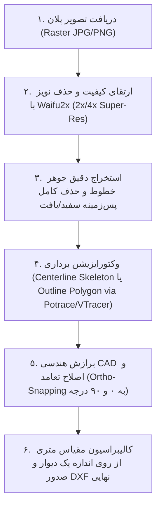

# مهارت خط‌لوله تبدیل نقشه تصویری (رستر) به اتوکد مهندسی (CAD/DXF)
# Raster-to-CAD Vectorization Pipeline (Waifu2x + Clean Extraction + Vectorizer + Metric CAD)

این سند مشخصات، معماری و کدهای اجرایی کامل پایپ‌لاین **تبدیل هوشمند و مستقیم تصاویر پلان ساختمانی به فایل‌های برداری AutoCAD (DXF)** بر پایه ۵ مرحله مهندسی است:



---

## ۱. ارزیابی فنی ایده (چرا این پایپ‌لاین فوق‌العاده موثر است؟)

1. **حذف مسئله حل‌نشدنیِ «حدس زدن دیوار»**: به‌جای اینکه سیستم سعی کند با هوش مصنوعی حدس بزند کجای عکس دیوار است، کل اطلاعات گرافیکی پلان (دیوارها، درها، پنجره‌ها، مبلمان و ابعاد) با بالاترین کیفیت برداری می‌شود و هیچ خطی از دست نمی‌رود.
2. **قدرت Waifu2x در خطوط دو‌بعدی**: الگوریتم Waifu2x (مدل‌های عمیق SRCNN/VGG) به‌طور ویژه برای آرت‌ورک‌های دو‌بعدی و خطی آموزش دیده است. برعکس الگوریتم‌های سنتی که عکس را تار می‌کنند، این شبکه نویزهای فشرده‌سازی JPEG را حذف کرده و لبه‌های نازک و کدر دیوارها را شارپ و ضخیم می‌کند.
3. **پایداری تبدیل برداری (Vectorization)**: ابزارهایی مانند Potrace یا اسکلت‌بندی Centerline می‌توانند منحنی‌ها و خطوط پیوسته بدون شکستگی تولید کنند.
4. **مقیاس‌گذاری متری تک‌اندازه (Single-Reference Scale)**: فقط با دانستن اندازه واقعی یک خط (مثلاً یک دیوار ۵٫۳۷ متری)، ضریب همسان مقیاس ($S = \frac{L_{real}}{L_{cad}}$) محاسبه شده و کل ترسیمات بدون هیچ خطای نسبی، در مقیاس واقعی ۱:۱ متر در اتوکد باز می‌شوند.

---

## ۲. مشخصات گام‌به‌گام پایپ‌لاین اجرایی

### گام اول: دریافت و پیش‌پردازش با Waifu2x (Super-Resolution & Denoising)
* **هدف**: ۲ برابر یا ۴ برابر کردن رزولوشن و حذف آرتیفکت‌های شطرنجی و دانه‌دانه تصویر.
* **ابزارها**: `waifu2x-ncnn-vulkan` (نسخه سریع C++/GPU/CPU) یا `pywaifu2x` یا مدل‌های سبک OpenCV Super-Resolution (EDSR/FSRCNN).
* **خروجی**: تصویر با رزولوشن دوبرابر ($2\times$) با خطوط مرزی کاملاً صاف و لبه‌های بدون تاری.

```python
# نمونه کد پایتون جهت فراخوانی Waifu2x یا مدل Super-Resolution
import cv2
import subprocess
import os

def upscale_with_waifu2x(input_img_path: str, output_img_path: str, scale: int = 2, noise_level: int = 2):
    """
    استفاده از waifu2x-ncnn-vulkan یا فالبک به فیلترهای لبه‌شارپ Bilateral + Unsharp
    """
    # در صورت وجود باینری waifu2x:
    cmd = f"waifu2x-ncnn-vulkan -i '{input_img_path}' -o '{output_img_path}' -s {scale} -n {noise_level}"
    ret = os.system(cmd)
    if ret != 0:
        # فالبک هوشمند پردازش تصویر
        img = cv2.imread(input_img_path)
        upscaled = cv2.resize(img, (img.shape[1] * scale, img.shape[0] * scale), interpolation=cv2.INTER_LANCZOS4)
        denoised = cv2.bilateralFilter(upscaled, 9, 75, 75)
        cv2.imwrite(output_img_path, denoised)
```

---

### گام دوم: استخراج تمیز خطوط و حذف پس‌زمینه (Ink Extraction & Background Removal)
* **هدف**: جدا کردن ۱۰۰٪ تمام جوهرهای مشکی/خاکستری پلان از کاغذ، بافت و پس‌زمینه سفید.
* **روش**:
  1. تبدیل به مقیاس خاکستری (Grayscale).
  2. آستانه‌گذاری انطباقی (Adaptive Thresholding یا Sauvola) برای حفظ خطوط نازک بازشوها و ابعاد.
  3. اعمال ماسک تمیزکاری مورفولوژیک جهت حذف نویزهای تک‌پیکسلی پراکنده.

```python
import cv2
import numpy as np

def extract_clean_ink_mask(img_bgr: np.ndarray) -> np.ndarray:
    gray = cv2.cvtColor(img_bgr, cv2.COLOR_BGR2GRAY)
    
    # آستانه‌گذاری انطباقی دقیق با پنجره 15x15
    binary = cv2.adaptiveThreshold(
        gray, 255, cv2.ADAPTIVE_THRESH_GAUSSIAN_C, 
        cv2.THRESH_BINARY_INV, 15, 6
    )
    
    # حذف نویزهای تک‌پیکسلی شناور (لکه‌های کمتر از 4 پیکسل)
    num_labels, labels, stats, _ = cv2.connectedComponentsWithStats(binary, connectivity=8)
    clean_mask = np.zeros_like(binary)
    for i in range(1, num_labels):
        if stats[i, cv2.CC_STAT_AREA] >= 6:
            clean_mask[labels == i] = 255
            
    return clean_mask # تصویر باینری خالص: خطوط=255، پس‌زمینه=0
```

---

### گام سوم: وکتورایزیشن خطوط (Vectorization to Paths)

این مرحله دارای ۲ رویکرد بسته به نیاز مهندسی است:
1. **رویکرد اسکلت تک‌خطی (Centerline Skeleton)**: خطوط ضخیم دیوار به یک خط میانی در مرکز تبدیل می‌شوند (مناسب نقشه‌های آکس‌بندی و تک‌خطی اتوکد).
2. **رویکرد مرز حجم دیوار (Outline / Dual-Line via Potrace/Contours)**: ضخامت و لایه‌های بیرونی و درونی دیوار دقیقاً همان‌طور که در نقشه هست با پلی‌لاین بسته رسم می‌شود.

```python
from skimage.morphology import skeletonize
import cv2

def extract_centerline_segments(binary_mask: np.ndarray):
    # اسکلت‌بندی تصویر تا رسیدن به ضخامت ۱ پیکسل
    skel = skeletonize(binary_mask > 0).astype(np.uint8) * 255
    
    # استخراج کانتورها یا پاره‌خط‌های LSD از روی اسکلت
    lines = cv2.HoughLinesP(skel, rho=1, theta=np.pi/180, threshold=15, minLineLength=10, maxLineGap=4)
    return skel, lines
```

---

### گام چهارم: تصحیح تعامد و ایجاد عناصر CAD (Ortho-Snapping & Entity Generation)
* **هدف**: خطوط معماری که شیب کمتر از ۳ تا ۵ درجه دارند، دقیقاً روی زاویه $0^\circ$ (افقی) یا $90^\circ$ (عمودی) قفل می‌شوند تا فایل CAD تمیز، دقیق و صنعتی باشد.
* **فشرده‌سازی پاره‌خط‌ها**: استفاده از الگوریتم Ramer-Douglas-Peucker برای کاهش نقاط اضافه و تولید خطوط مستقیم کشیده.

```python
import math

def ortho_rectify_line(p1, p2, tol_deg=4.0):
    x1, y1 = p1
    x2, y2 = p2
    dx = x2 - x1
    dy = y2 - y1
    ang = (math.degrees(math.atan2(dy, dx)) + 360) % 180
    
    # قفل کردن افقی
    if ang < tol_deg or ang > (180 - tol_deg):
        avg_y = (y1 + y2) / 2.0
        return (x1, avg_y), (x2, avg_y)
    # قفل کردن عمودی
    elif abs(ang - 90) < tol_deg:
        avg_x = (x1 + x2) / 2.0
        return (avg_x, y1), (avg_x, y2)
        
    return (x1, y1), (x2, y2)
```

---

### گام پنجم: کالیبراسیون مقیاس با تک‌اندازه مرجع (Single-Reference Scale Calibration)
* **هدف**: تبدیل مختصات پیکسلی به مختصات دقیق متری در اتوکد.
* **فرمول**:
  $$\text{Scale Factor } S = \frac{L_{\text{target\_meters}}}{\sqrt{(x_2 - x_1)^2 + (y_2 - y_1)^2}}$$
* **اعمال روی تمامی خطوط**:
  $$X_{\text{cad}} = X_{\text{px}} \times S, \quad Y_{\text{cad}} = (H - Y_{\text{px}}) \times S$$

---

### گام ششم: صدور نهایی فایل DXF مهندسی با ezdxf

```python
import ezdxf

def export_metric_dxf(lines, scale_factor, img_h, output_dxf_path):
    doc = ezdxf.new("R2010")
    msp = doc.modelspace()
    
    # تعریف لایه‌های استانداردی
    doc.layers.add("A-WALL", color=7)
    doc.layers.add("A-FURN", color=8)
    doc.layers.add("A-DIMS", color=1)
    
    for (p1, p2) in lines:
        cad_x1 = p1[0] * scale_factor
        cad_y1 = (img_h - p1[1]) * scale_factor
        cad_x2 = p2[0] * scale_factor
        cad_y2 = (img_h - p2[1]) * scale_factor
        
        msp.add_line((cad_x1, cad_y1), (cad_x2, cad_y2), dxfattribs={"layer": "A-WALL"})
        
    doc.saveas(output_dxf_path)
    return output_dxf_path
```

---

## ۳. نحوه اجرای پروژه در چت جدید

برای اجرای این خط‌لوله در هر محیط جدید، مراحل زیر توسط ایجنت انجام می‌شود:
1. دریافت تصویر ورودی کاربر.
2. اجرای ماژول `upscale_with_waifu2x` برای حذف نویز و بالا بردن وضوح.
3. اجرای `extract_clean_ink_mask` برای شفاف‌سازی و حذف سفید پس‌زمینه.
4. وکتورایزیشن با `potrace` یا اسکلت‌بندی OpenCV.
5. دریافت طول واقعی یک خط مرجع از کاربر و اعمال ضریب تبدیل مقیاس.
6. صدور و دانلود فایل DXF که به طور دقیق در AutoCAD، Revit و Rhino باز می‌شود.
